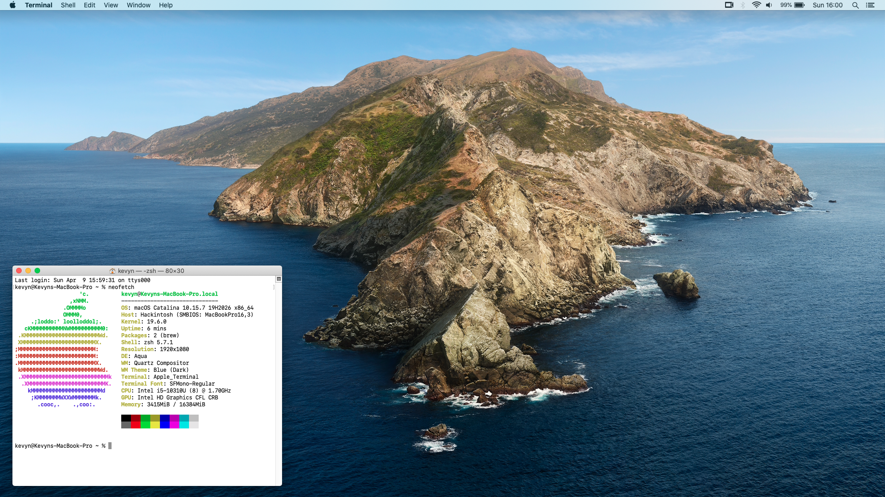

## specs
- macOS version: 10.15.7 (Catalina)
- OpenCore version: 0.8.8 DEBUG
- SMBIOS: MacBookPro16,3 (13 inch, 2020, 2 TB3)
- CPU & GPU: Intel Core i5-10310U / UHD 630
- Display: 1080p non-touch
- Thunderbolt controller: Intel JHL7540
- Audio codec: ALC295
- Internal storage: SK Hynix BC511 NVMe

## working / tested
- Wi-Fi
- Bluetooth
- Trackpad (with gestures)
- Integrated graphics
- Audio (internal speakers, bluetooth headphones)
- I/O (USB-A and USB-C ports)
- Integrated webcam

## not working / untested
- MicroSD card slot
- HDMI
- iMessage, FaceTime, AirDrop etc.
- Battery life is poor (compared to other OS's)
- Laptop gets hot easily (compared to other OS's)
